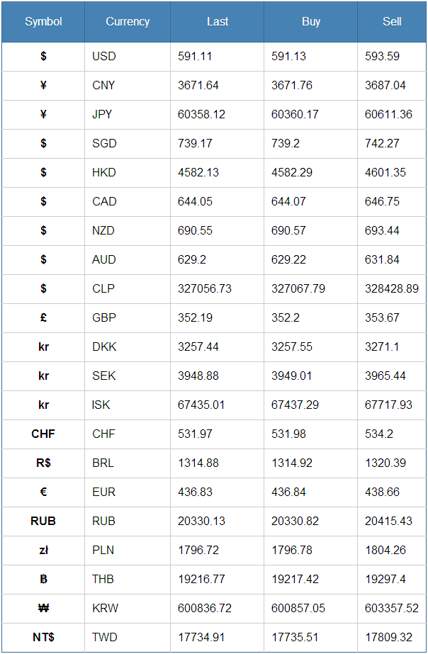

# &lt;bitcoin-rates&gt;

> A web component to show a bitcoin rates.

## How-to
```html
<bitcoin-rates></bitcoin-rates>
```


## Maintained by
- Kreshnik Hasanaj (Ninja)
- E-mail: [kreshnik.hasanaj@gmail.com](mailto:kreshnik.hasanaj@gmail.com)
- Twitter: [@KreshHanzo](http://twitter.com/KreshHanzo)
- Web: [http://ninxha.com](http://ninxha.com)

## License
Licensed under the MIT license.

Copyright (c) 2014 [@KreshHanzo](http://twitter.com/KreshHanzo).